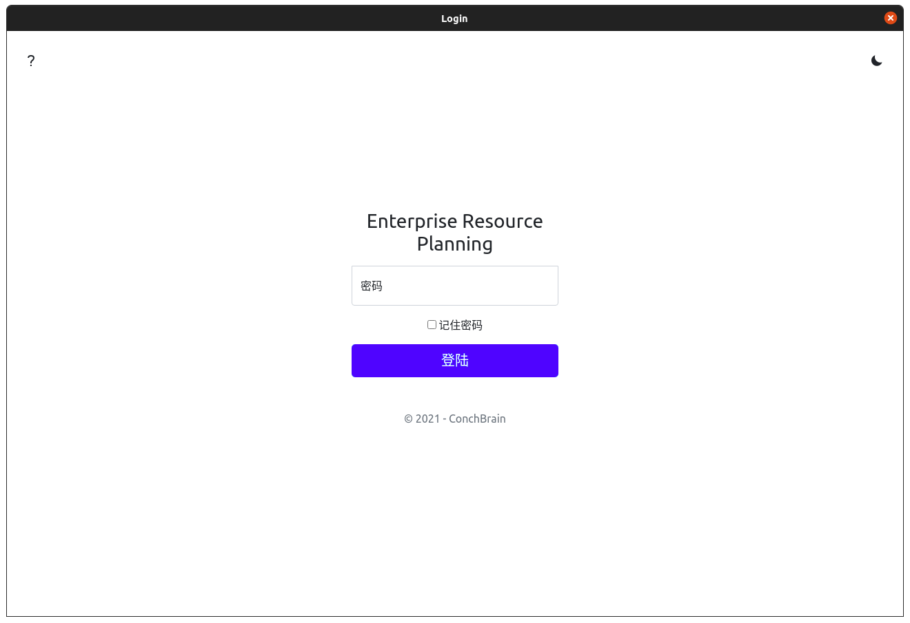
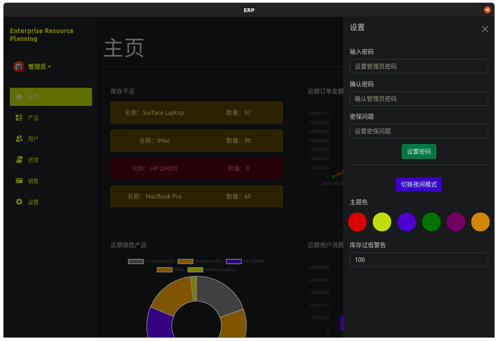
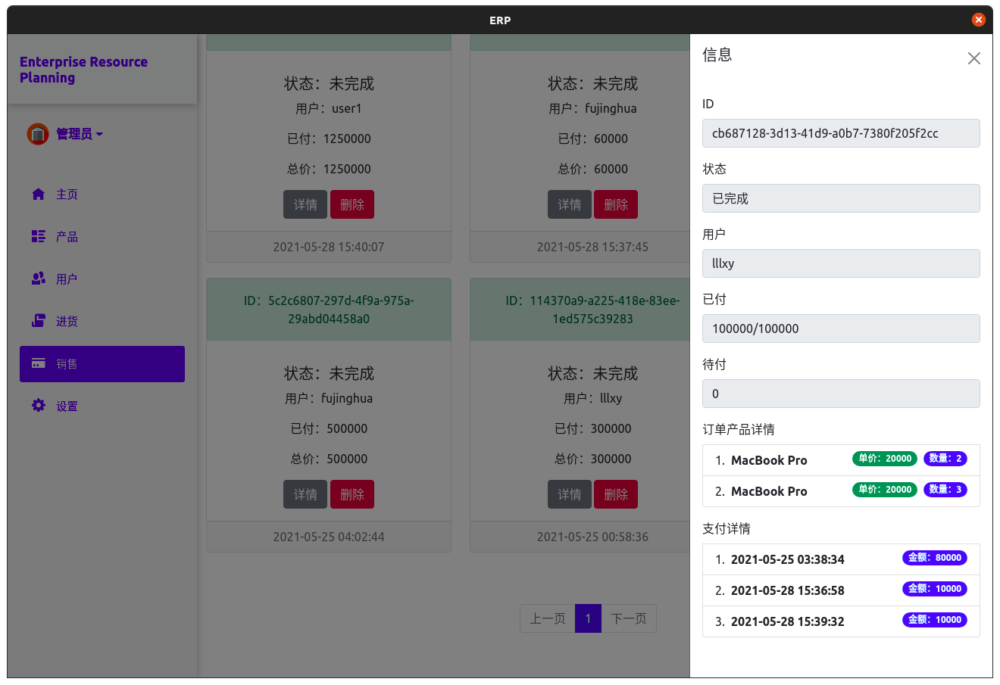
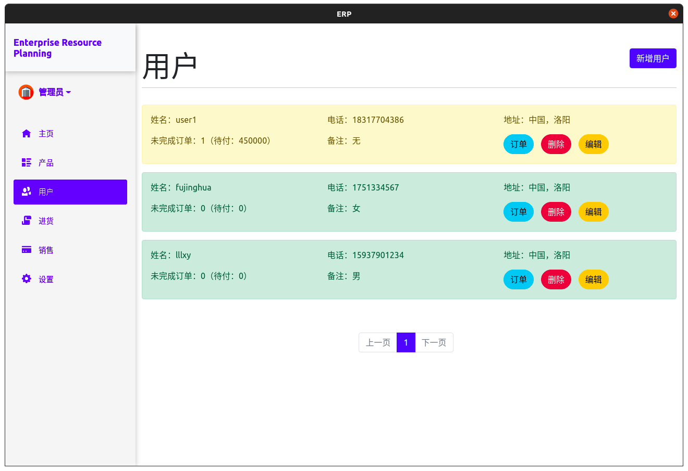
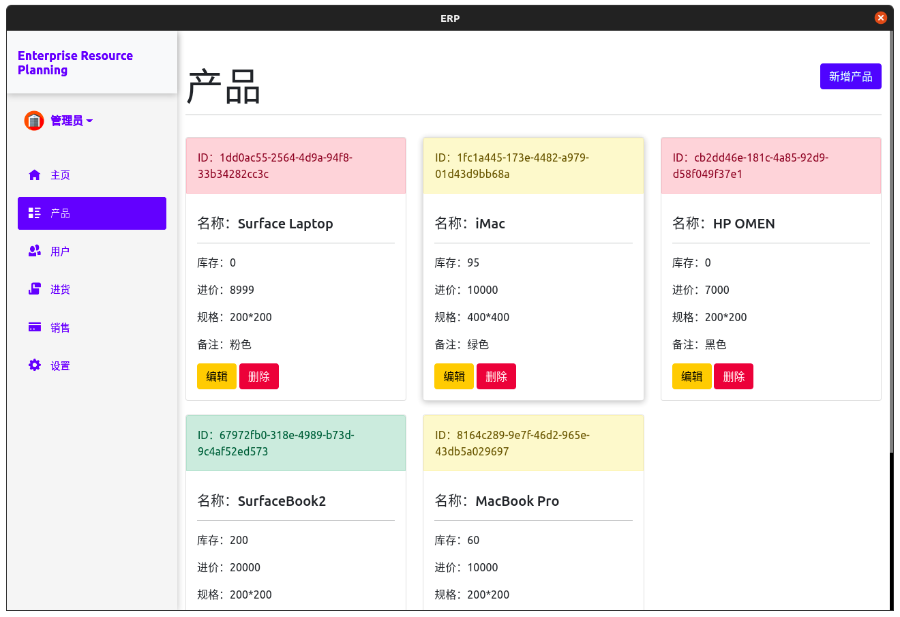

# ERP

Flask Desktop app base on Flask & Electron

### How to Contribute?

Install pre-requisites

- Python3
- Python3-pip
- Node.js
- npm

##### On Windows

- Visit [Python official website](https://www.python.org/) to download Python ( Included pip )

- Install [Nodejs official website](https://nodejs.org/) ( Included npm )

##### On Linux

- Install Python & Python-pip
    - Ubuntu
        ```bash
        apt install python3 python3-pip -y
        ```

    - CentOS
        ```bash
        dnf install python3 python3-pip -y
        ```

- Install Node.js & npm
    - Ubuntu
        ```bash
        apt install nodejs -y
        ```

    - CentOS
        ```bash
        dnf install nodejs -y
        ```


### Create database

```bash
sqlite server/src/erp.db < server/database.sql
```

### Restore dependencies

Restore backend dependencies.

```bash
cd server
pip3 install -r requirements.txt
```

Restore frontend dependencies.

```bash
cd client
npm install
```

Restore backend and frontend dependencies with script.

- use bash

    ```bash
    bash scripts/restore.sh
    ```

- use powershell

    ```powershell
    pwsh scripts/restore.ps1
    ```

### Run

build backend and move it to frontend resources folder.

```bash
pyinstaller -F server/main.spec
mkdir -p client/resources/server
mv dist/main/* client/resources/server
```

run frontend

```bash
npm run start
```

### build

use build script.

- use bash

    ```bash
    bash scripts/build.sh
    ```
    
- use powershell

    ```powershell
    pwsh scripts/build.ps1
    ```

### screenshots

- Login



- DarkMode



- Sale manager



- User manager



- Product manager

